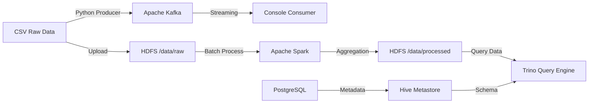

# 🚌 Bus GPS Data Pipeline

Dự án **Big Data Pipeline** xử lý dữ liệu hành trình xe buýt (GPS) theo **Real-time Streaming** và **Batch Processing**, tích hợp các công nghệ: **Kafka, Hadoop HDFS, Spark, Hive và Trino**.


---

## 📊 Dataset

* **Nguồn dữ liệu**: Giả lập GPS xe buýt (~1.000.000 bản ghi)
* **Thuộc tính**:

  * `datetime`
  * `vehicle_id`
  * `lng`, `lat`
  * `speed`
  * `driver`
  * `door_status`
* **Luồng dữ liệu**:

```
CSV Raw → Kafka (Streaming) → Spark (Processing) → HDFS (Storage) → Trino (Analytics)
```

---

## 🏗️ Architecture



---

## 🐳 Tech Stack

| Component  | Technology     | Version | Role                                |
| ---------- | -------------- | ------- | ----------------------------------- |
| Ingestion  | Apache Kafka   | 7.4.0   | Message Queue cho dữ liệu Real‑time |
| Storage    | Hadoop HDFS    | 3.2.1   | Lưu trữ dữ liệu phân tán            |
| Processing | Apache Spark   | 3.4.0   | Batch processing & aggregation      |
| Metadata   | Hive Metastore | 2.3.2   | Quản lý schema (PostgreSQL backend) |
| Analytics  | Trino          | 427     | SQL query trên HDFS                 |
| Infra      | Docker Compose | –       | Quản lý hạ tầng container           |

---

## 🚀 Quick Start Guide

### 1. Khởi tạo môi trường

```bash
# Clone repo & setup Python virtual environment
python3 -m venv .venv
source .venv/bin/activate
pip install -r requirements.txt

# Khởi động toàn bộ hệ thống (9 services)
docker compose up -d
```

---

### 2. Cấu hình Hive Metastore (Quan trọng)

Hive Metastore dùng PostgreSQL backend, cần init schema **chỉ một lần**:

```bash
# Khởi tạo schema cho Hive
docker compose run --rm hive-metastore \
  /opt/hive/bin/schematool -dbType postgres -initSchema

# Restart Hive Metastore
docker restart hive-metastore
```

---

### 3. Tạo dữ liệu mẫu

```bash
# Tạo file giả lập ~1 triệu bản ghi
python3 scripts/create_sample_data.py
# Chọn: sample_medium_test.csv
```

---

## 🧪 Testing Scenarios

### Scenario 1: Real-time Streaming (Kafka)

**Consumer (Terminal 1):**

```bash
docker exec big-data-assignment-kafka-1 kafka-console-consumer \
  --bootstrap-server localhost:9092 \
  --topic bus-gps-tracking \
  --from-beginning
```

**Producer (Terminal 2):**

```bash
python3 src/kafka/producer.py data/samples/sample_medium_test.csv
```

✅ **Kỳ vọng**: Consumer hiển thị dữ liệu JSON liên tục.

---

### Scenario 2: Batch Processing (Spark & HDFS)

**Upload dữ liệu lên HDFS:**

```bash
docker exec big-data-assignment-namenode-1 \
  hdfs dfs -mkdir -p /data/raw

docker cp data/raw_2025-04-01.csv \
  big-data-assignment-namenode-1:/tmp/

docker exec big-data-assignment-namenode-1 \
  hdfs dfs -put -f /tmp/raw_2025-04-01.csv /data/raw/
```

**Submit Spark Job:**

```bash
docker cp src/spark/batch_processing.py \
  big-data-assignment-spark-master-1:/opt/spark/work-dir/

docker exec big-data-assignment-spark-master-1 \
  /opt/spark/bin/spark-submit \
  --master spark://spark-master:7077 \
  /opt/spark/work-dir/batch_processing.py
```

✅ **Kỳ vọng**: Log `Batch Job Completed Successfully!`

**Kiểm tra HDFS:**

```bash
docker exec big-data-assignment-namenode-1 \
  hdfs dfs -ls -R /data/processed
```

---

### Scenario 3: Data Analytics (Trino SQL)

**Vào Trino CLI:**

```bash
docker exec -it trino trino
```

**Tạo schema & bảng:**

```sql
CREATE SCHEMA IF NOT EXISTS hive.bus_data;

CREATE TABLE IF NOT EXISTS hive.bus_data.driver_stats (
   driver varchar,
   avg_speed double,
   max_speed double,
   trip_count bigint
)
WITH (
   format = 'PARQUET',
   external_location = 'hdfs://namenode:9000/data/processed/driver_stats'
);
```

**Query phân tích:**

```sql
SELECT *
FROM hive.bus_data.driver_stats
ORDER BY trip_count DESC
LIMIT 10;
```

✅ **Kỳ vọng**: `trip_count > 1000`

---

## 🛠️ Troubleshooting & Fixes

### Python 3.12 Compatibility

* **Lỗi**: `ModuleNotFoundError: No module named 'distutils'`
* **Fix**: `numpy>=1.26.4`, `setuptools` trong `requirements.txt`

### Trino HDFS Connection

* **Lỗi**: `External location is not a valid file system URI`
* **Fix**:

  * Downgrade `trinodb/trino:427`
  * Cấu hình `hive.config.resources` → `core-site.xml`

### CSV / Encoding Issues

* **Lỗi**: Không đọc được file CSV (BOM, delimiter `\t`)
* **Fix**:

  * Python: `encoding='utf-8-sig'`
  * Spark: `delimiter="\t"`

---

## 📋 Project Status

* [x] Docker Infrastructure (9 services healthy)
* [x] Data Generation
* [x] Kafka Streaming
* [x] HDFS Storage
* [x] Spark Batch Processing
* [x] Hive Metastore Integration
* [x] Trino Analytics

---

## 📄 License

MIT License
